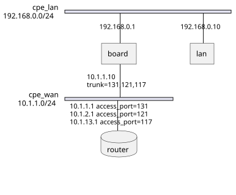

# Raikou-Net (雷光ネット)

<p align=center>
     <br>
    
    
    
    
    <a href="https://github.com/psf/black"></a>
    <a href="https://github.com/astral-sh/ruff"></a>
</p> <hr>

Raikou-Net is a Docker-in-Docker topology orchestrator. It wires other
containers on the same host into a declarative network topology using a
pluggable dataplane: Open vSwitch (OVS, the default) or plain Linux bridges
today, with room for additional backends later.

The orchestrator runs `privileged`, `pid: host`, and `network_mode: host`,
mounts the host Docker socket, and pushes veth interfaces into peer
containers based on a single declarative `config.json`. It also exposes a
small FastAPI REST surface for mutating topology on the fly.

## Quick start

`make demo` brings up a published stack in a Vagrant VM, with no local build:

```bash
make demo                      # prplos stack (default)
make demo EXAMPLE=rdk_lxd      # RDK CPE as an LXD container
make demo-down                 # halt the VM (pass EXAMPLE= to match)
```

### Examples

| Example | CPE | Dataplane | Verification |
| --- | --- | --- | --- |
| [`examples/prplos`](examples/prplos) | PrplOS Docker `cpe` service | OVS or Linux bridge | `make smoke` (CI-gated) |
| [`examples/rdk_lxd`](examples/rdk_lxd) | RDK-generic LXD container | Linux bridge | demo only |

Both examples share the same double-hop topology and differ only in the CPE.
`prplos` is the reference variant, exercised by `make smoke` in CI.

## Dataplane backends

The dataplane is pluggable and selected at runtime. Open vSwitch (the default)
provides VLAN tagging, trunking, and flow-based control; plain Linux bridges
(`USE_LINUX_BRIDGE=true`) are a lighter alternative. Both are driven from the
same `config.json`. See the
[OVS + Docker documentation](https://ovs.readthedocs.io/en/latest/howto/docker.html).


## Features

- Two interchangeable dataplane backends: OVS (default) or Linux bridges
  (`USE_LINUX_BRIDGE=true`)
- Declarative topology from a single `config.json`, hot-reloaded every 15s
- Attaches containers to bridges via `ovs-docker` / `lxbr-docker`
- VLAN access / trunk / native tagging on container ports
- VLAN translation via `veth_pairs` (S-VLAN ↔ C-VLAN)
- Static or auto-allocated IPv4 / IPv6 addressing, with gateway and MAC
- FastAPI REST endpoints to add/remove bridges, container ifaces, and
  veth pairs at runtime without rewriting `config.json`

## Building from source

The repo ships a top-level `Makefile` that wraps `docker buildx bake`,
pre-commit, Vagrant, and the GHCR push flow. Run `make help` to see every
target with a one-line description.

| Target                    | Purpose                                                                       |
| ------------------------- | ----------------------------------------------------------------------------- |
| `make help`               | Print every target with its description                                       |
| `make lint`               | Run `pre-commit run --all-files`                                              |
| `make build`              | Build the orchestrator + 11 component images                                  |
| `make build-orchestrator` | Build only the top-level orchestrator image                                   |
| `make build-components`   | Build only the component images (no orchestrator)                             |
| `make <name>`             | Build a single image — e.g. `make router`, `make ssh`, `make cpe`             |
| `make bump VERSION=v4`    | Bump the published image tag (rewrites `VERSION` and `examples/*/.env`)       |
| `make push`               | Push the 11-image set to GHCR (`LATEST=no` to skip the `:latest` tag)         |
| `make demo`               | Spin up an example stack in Vagrant, no local build (`EXAMPLE=prplos\|rdk_lxd`) |
| `make demo-down`          | Halt the demo VM (`EXAMPLE=` to match)                                        |
| `make smoke`              | Build locally + ship to Vagrant + run the smoke probe + teardown              |
| `make smoke-up`           | Same as `smoke` minus the probe and teardown (leaves the VM up for poking)    |
| `make smoke-logs`         | Dump orchestrator log + per-service compose logs from inside the VM           |
| `make clean`              | Remove local image tags this Makefile produced                                |

The image matrix is declared in [docker-bake.hcl](docker-bake.hcl). `make
build` produces both local tags (`ssh:v2.0.0`, used to resolve downstream
`FROM` lines) and GHCR-style tags
(`ghcr.io/ketantewari/raikou/<name>:${VERSION}` and `:latest`). See the
[Developer notes](#developer-notes) section below for the versioning
protocol.

## Prerequisites

Before deploying Raikou-Net, ensure that you have the following prerequisites:

- Docker installed on the host machine.
- OVS installed on the host machine (only if running with the default OVS
  backend; not required when `USE_LINUX_BRIDGE=true`).
- The `openvswitch` kernel module loadable from the host (OVS backend only).
- Basic understanding of Docker and container networking concepts.
- A properly configured `config.json` file for the topology.

To install openvswitch in Debian/Ubuntu:
```bash
sudo apt install openvswitch-switch openvswitch-common
```
To install openvswitch in Alpine:
```bash
sudo apk add -u openvswitch
```

To install docker engine and compose plugin, please follow the below link: <br>
[Install Docker in Ubuntu/Debian](https://docs.docker.com/engine/install/ubuntu/#install-using-the-repository)


## Deployment

To deploy Raikou-Net, follow these steps:

1. Clone the Raikou-Net repository.

2. Prepare the `config.json` file with the necessary topology configuration.
Ensure it is placed in the same directory as the Raikou-Net files.
For syntax details, please refer to the following page:
[Raikou-Net Configuration Syntax](./docs/CONFIG.README.md)

3. Create a `docker-compose.yml` file with the desired container dependencies and configuration.

    ```yaml
    services:
        raikou:
            build:
                context: .
                dockerfile: Dockerfile
            container_name: raikou-net
            volumes:
                - /lib/modules:/lib/modules
                - /var/run/docker.sock:/var/run/docker.sock
                - ./config.json:/root/config.json
            privileged: true
            pid: "host"
            network_mode: "host"
            hostname: "orchestrator"
            environment:
                USE_LINUX_BRIDGE: "false"   # "true" -> brctl/bridge instead of OVS
                DEBUG: "no"
            depends_on:
                - container1
                - container2
                - container3
    ```

   - Adjust the `build` section if you have customized the Dockerfile name
   or location.
   - Update the `volumes` section to map the necessary directories and files,
   including the `config.json` file.
   - Modify the `depends_on` section to include the containers that
   raikou should handle with OVS.


4. Build the Docker image using the following command:

   ```shell
   docker-compose build
   ```

   This command builds the Raikou-Net image based on the provided Dockerfile.

5. Run the following command to start the Raikou-Net container:

   ```shell
   docker-compose up -d
   ```

   This command starts the container in detached mode,
   allowing it to run in the background.

6. Verify that the Raikou-Net container is running by checking the
container logs or running `docker ps`.

> The reconcile loop re-reads `/root/config.json` every 15 seconds, so most
> topology edits take effect without restarting the container. `docker
> compose restart raikou` is only needed if reconcile gives up after
> repeated failures.

### Environment knobs

The orchestrator container reads these env vars (defaults from the
[Dockerfile](Dockerfile)):

| Variable             | Default   | Purpose                                                                  |
| -------------------- | --------- | ------------------------------------------------------------------------ |
| `USE_LINUX_BRIDGE`   | `false`   | Use `brctl`/`bridge` instead of OVS. Skips supervisord's `ovsvswitch`.   |
| `DEBUG`              | `no`      | `yes` raises the logger level to DEBUG.                                  |
| `UVICORN_HOST`       | `0.0.0.0` | Bind address for the REST API.                                           |
| `UVICORN_PORT`       | `8080`    | Listen port for the REST API.                                            |
| `DOCKER_API_VERSION` | `1.41`    | Pinned because the bundled Docker CLI may be newer than the host daemon. |

### Overriding peer-component configs via compose mounts

Every component image under [components/](components/) ships its defaults
under a sibling `.dist/` directory (for example `/etc/kea.dist/`,
`/etc/frr.dist/`, `/etc/kamailio.dist/`, `/root/aftr.dist/`). The container's
`init` script copies any missing entry into the live path on startup, so a
`docker compose` bind-mount on the live path is treated as an authoritative
override — the baked default is left alone.

In practice that means a stanza like

```yaml
dhcp:
    image: ghcr.io/.../dhcp:v1
    volumes:
        - ./config/kea-dhcp4.conf:/etc/kea/kea-dhcp4.conf
```

fully replaces the baked `kea-dhcp4.conf`. No mount → the baked default ships
through unchanged.

The router image goes one step further: `/etc/frr/frr.conf` is regenerated
from `/etc/frr.dist/frr.conf` on every start and then env-driven interface
blocks are appended, so restarts cannot double-append. If you bind-mount
`/etc/frr/frr.conf` the regeneration and the env-driven appends are both
skipped — the mount is treated as your authoritative copy.

### Live mutation via REST API

`uvicorn` serves a FastAPI app on `UVICORN_HOST:UVICORN_PORT` with three
routers ([app/routers/](app/routers/)):

- `/bridge`    — create / delete / inspect bridges
- `/container` — attach or detach container interfaces
- `/veth`      — create / delete VLAN-translating veth pairs

Each handler takes `EVENT_LOCK` before mutating host networking, so it is
safe to call concurrently with the 15s reconcile loop.

## How the topology configuration works

Consider we would like to have board, lan and router containers
connected to each other in the following topology:



This can be achieved with the following steps:

#### Step 1: Create the necessary OVS bridges

We would require 2 bridges ```cpe-wan``` and ```cpe-lan``` in this case

```json
{
    "bridge": {
        "cpe-lan": {},
        "cpe-wan": {}
    }
}
```

#### Step 2: Connect container to respective bridges

LAN and board both should get connected to ```cpe-lan``` bridge
with interface name ```eth1```

```json
{
    "bridge": {
        "cpe-lan": {},
        "cpe-wan": {}
    },
    "container": {
        "lan": [
            {
                "bridge": "cpe-lan",
                "iface": "eth1"
            }
        ],
        "board": [
            {
                "bridge": "cpe-lan",
                "iface": "eth1"
            },
        ]
    }
}
```

Board and BNG get connected to ```cpe-wan``` but with a different
interface name.

We can also notice that the board needs to allow 3 VLANs on its interface
We can decide a container port to be Access VLAN port using ```vlan```
or in trunk mode using ```trunk```.

```json

{
    "bridge": {
        "cpe-lan": {},
        "cpe-wan": {}
    },
    "container": {
        "lan": [
            {
                "bridge": "cpe-lan",
                "iface": "eth1"
            }
        ],
        "board": [
            {
                "bridge": "cpe-lan",
                "iface": "eth1"
            },
            {
                "bridge": "cpe-wan",
                "iface": "eth0",
                "trunk": "131,121,117"
            }
        ],
        "router": [
            {
                "bridge": "cpe-wan",
                "iface": "eth0",
                "vlan": "121"
            },
            ...
        ]
    }
}
```

If we want to statically assing IP addresses to a container port.

```json
{
    "bridge": {
        "cpe-wan": {
            "parents": [
                {
                    "iface": "eno3"
                }
            ]
        }
    },
    "container": {
        "wan": [
            {
                "bridge": "cpe-wan",
                "iface": "eth1",
                "ipaddress": "172.25.1.101/24",
                "gateway": "172.25.1.1",
                "ip6address": "2001:dead:beef:2::101/64",
                "gateway6": "2001:dead:beef:2::1"
            }
        ]
    }
}
```

> Note: ```parents``` will allow an OVS bridge to get connected to an actual
> physical interface on the host machine


#### Step 3. Restart the docker-compose orchestrator service

```bash
docker compose restart
```

(Only needed if the live reconcile / REST API can't apply the change.)

## Trying it out with Vagrant (`examples/prplos/`)

[examples/prplos/Vagrantfile](examples/prplos/Vagrantfile) spins up an
Ubuntu 22.04 VM, installs Docker + the `openvswitch` kernel module, and runs
the full double-hop stack (orchestrator + router/wan/lan/dhcp/cpe/acs/sip/
phones/mongo). Every container port published by the compose file is forwarded
`guest == host`, so the stack is reachable at `localhost:<port>` on your
workstation. The RDK variant lives in [`examples/rdk_lxd`](examples/rdk_lxd)
and is driven with `make demo EXAMPLE=rdk_lxd`.

For a one-command demo of the published GHCR stack (no local build):

```bash
make demo            # vagrant up — pulls ghcr.io/ketantewari/raikou/*:v3
make demo-down       # vagrant halt
```

To pick a different compose variant, run vagrant directly:

```bash
cd examples/prplos
COMPOSE_FILE=docker-compose.yaml          vagrant up            # build from local components/
COMPOSE_FILE=docker-compose.ghcr_rdkb.yaml vagrant provision    # switch stack on a running VM
```

`make demo` is the fastest path to "see it work" because it skips the
local build entirely; `make smoke` (and `make smoke-up`) instead builds
every image from your local source tree, ships the result into the same
VM, and runs the stack — use that to validate unmerged changes. CI runs
`make smoke` on every PR.

Things worth knowing before you change the Vagrant setup:

- The box is `generic/ubuntu2204` because it ships both VirtualBox and
  libvirt images. `bento/*` is VirtualBox-only and hangs under libvirt at
  *"Waiting for domain to get an IP address..."*.
- The provisioner `modprobe`s `openvswitch` and persists it via
  `/etc/modules-load.d/openvswitch.conf` — the orchestrator bind-mounts
  `/lib/modules` and calls `ovs-ctl force-reload-kmod`, which fails
  without this.
- A systemd unit (`raikou-prplos.service`) owns the compose lifecycle.
  `ExecStart` runs `up -d` on every boot, `ExecStop` runs `compose down`
  on shutdown so containers exit cleanly before `docker.service` stops.
- `COMPOSE_FILE` is baked into the unit at provision time, not read at
  boot. To switch stacks on a running VM, re-run `vagrant provision` with
  the new value (the provisioner stops the old unit first so the old
  `ExecStop` tears down the right stack).
- The synced folder uses `rsync` for provider portability. Edits to
  `config.json` or `config/kea-dhcp*.conf` on the host do **not**
  auto-propagate — run `vagrant rsync` (or `vagrant rsync-auto` in a side
  terminal) and then restart the affected container.

## Developer notes

### Image versioning protocol

This repo has two independent version axes:

| Axis              | Source of truth                  | Bumped by              | Used in                                                                |
| ----------------- | -------------------------------- | ---------------------- | ---------------------------------------------------------------------- |
| **Code version**  | git tags, `.cz.toml`             | `cz bump`              | Git release tags (currently `v2.x`)                                    |
| **Image version** | the `VERSION` file at repo root  | `make bump VERSION=v4` | GHCR image tags via `${VERSION}` interpolation (currently `:v3`)       |

The two cuts intentionally diverge — the published image tag moves on a
different cadence than the code release line.

`make bump VERSION=v4` does exactly two things:

1. Rewrites the root `VERSION` file.
2. Rewrites every `examples/*/.env` that already has a `VERSION=` line,
   so the compose files (which interpolate `${VERSION}` from their
   sibling `.env`) follow automatically.

It does *not* commit, tag, or push. Review the diff with `git diff`,
commit it, then run `make push`. Malformed values (empty, no `v` prefix,
trailing separator) are rejected before any file is touched.

### Building & publishing to a registry

`make push` first runs `make build` (so a fresh push always reflects the
current tree), then `docker buildx bake --push push-set` publishes the
11-image set with two tags each: `:${VERSION}` and `:latest`.

Both `build` and `push` honor a `REGISTRY=` override (default
`ghcr.io/ketantewari/raikou`), allowing publication to any registry — for
example a locally hosted one — instead of GHCR:

```bash
make build REGISTRY=localhost:5000/raikou VERSION=dev
make push  REGISTRY=localhost:5000/raikou VERSION=dev
```

`VERSION=` sets the image tag; the legacy `GHCR_REGISTRY=` name remains a
supported alias.

To push a versioned tag without moving `:latest` (release candidates,
dev builds):

```bash
make push LATEST=no
```

Releases are pushed manually from a developer workstation; CI runs
`make build` and `make smoke` on every PR but never pushes. The `ssh`
base image must be reachable in the registry before downstream component
images can be built from a fresh clone without local source, so `make
push` always publishes both `ssh` and its dependents in a single bake
invocation.

### Build matrix

The 12-target image matrix (1 orchestrator + 11 components) is declared
in [docker-bake.hcl](docker-bake.hcl). The six ssh-dependent components
(`router`, `wan`, `lan`, `dhcp`, `ntp`, `router-ethernet`) declare
`contexts = { "ssh:v2.0.0" = "target:ssh" }`, so `docker buildx bake`
handles the build order natively — `ssh` is built first and wired into
the downstream `FROM` resolution without ever touching the registry.

One target is build-only (not published to GHCR): `router-ethernet`.
It is built by CI so a Dockerfile breakage is caught, but is consumed
by other projects rather than published from this repo.

## Contributing

Contributions to the Raikou-Net project are welcome!
If you find any issues or have suggestions for improvement,
please open an issue or submit a pull request.

## License

This project is licensed under the [MIT License](LICENSE).

---
